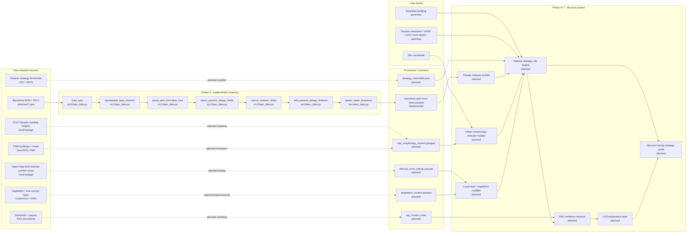

# Pipeline Architecture v1 — Passive Design Advisor: Barcelona 2025

> It evolves `docs/system-sketch-v0.md` into a pipeline with real Phase 3 cleaning boxes. The EPW climate cleaning is implemented now; the other adopted datasets remain planned or separately preprocessed modules.

---

## What changed since v0

In Session 2, the system sketch showed the overall advisor:

> user geometry + climate + urban morphology + thermal context + vegetation + passive thresholds → rule engine → RAG explanation → user-facing strategy cards.

In Session 3, the first implemented cleaning pipeline is the **Barcelona EPW / TMYx climate dataset**. This file therefore separates:

- **Implemented now:** EPW cleaning in `src/clean_data.py`
- **Planned / next:** ICGC Alçades cleaning, OSM morphology extraction, thermal comfort zone lookup, vegetation context preprocessing, passive-threshold table construction, RAG knowledge-base preparation
- **Future output:** decision-facing Passive Design Advisor web/report cards

---

## The diagram

---

## Components — implemented now: EPW cleaning

### `load_epw`

- **File:** `src/clean_data.py`
- **Input contract:** raw `.epw` file at `data/raw/ESP_CT_Barcelona-El.Prat.AP.081810_TMYx.epw`
- **Output contract:** raw EPW dataframe + EPW metadata dictionary
- **Failure mode:** raises `FileNotFoundError` if the file is missing; raises `ImportError` if `pvlib` is not installed
- **Tests / assertions:** later pipeline confirms 8,760 rows
- **Cleaning log entry:** Transform 1 in `docs/data-cleaning-log.md`

### `standardise_epw_columns`

- **File:** `src/clean_data.py`
- **Input contract:** dataframe returned by `pvlib.iotools.read_epw`
- **Output contract:** dataframe with unit-explicit names such as `dry_bulb_temp_c`, `wind_speed_m_s`, and radiation fields in `Wh/m²`
- **Failure mode:** raises `ValueError` if required pvlib fields are missing
- **Tests / assertions:** `require_columns()`
- **Cleaning log entry:** Transform 2

### `parse_and_normalise_time`

- **File:** `src/clean_data.py`
- **Input contract:** dataframe with a timestamp column or EPW datetime index already converted to a timestamp column
- **Output contract:** explicit `timestamp`, `month`, `day`, and `hour_of_day`
- **Failure mode:** raises if timestamp parsing fails
- **Tests / assertions:** final invariant requires non-null, unique timestamps
- **Cleaning log entry:** Transform 3

### `select_passive_design_fields`

- **File:** `src/clean_data.py`
- **Input contract:** standardised EPW dataframe
- **Output contract:** selected climate fields required for passive strategy scoring
- **Failure mode:** raises if required selected fields are missing
- **Tests / assertions:** final schema check
- **Cleaning log entry:** Transform 4

### `coerce_numeric_fields`

- **File:** `src/clean_data.py`
- **Input contract:** selected climate dataframe
- **Output contract:** numeric climate fields
- **Failure mode:** raises if coercion creates missing values
- **Tests / assertions:** no nulls introduced in numeric fields
- **Cleaning log entry:** Transform 5

### `add_passive_design_features`

- **File:** `src/clean_data.py`
- **Input contract:** cleaned numeric climate dataframe
- **Output contract:** derived climate indicators for first-pass rule logic
- **Failure mode:** raises if required columns are missing
- **Tests / assertions:** final invariant checks boolean fields
- **Cleaning log entry:** Transform 7

### `assert_clean_invariants`

- **File:** `src/clean_data.py`
- **Input contract:** final cleaned EPW dataframe
- **Output contract:** no data output; validates the dataset contract
- **Failure mode:** assertion failure if row count, schema, timestamp uniqueness, or broad climate ranges fail
- **Tests / assertions:** exactly 8,760 rows; final columns present; climate ranges plausible
- **Cleaning log entry:** Transform 8

---

## Components — planned next

| Component | Lands in | One-line role |
|---|---|---|
| ICGC Alçades cleaning | Session 3 extension / Session 4 support | Derive building heights from `Z_MAX_VOL - Z_MIN_VOL`, filter artefacts, and produce morphology lookup |
| OSM morphology extraction | Session 4 support | Query footprints and roads around a selected site for density and street-context indicators |
| Thermal comfort zone lookup | Session 4 support | Spatially assign site to `gridcode` 1–6 and use as UHI/heat-risk modifier |
| Vegetation context preprocessing | Session 4–5 support | Compute green-cover / canopy ratio around site buffers |
| Strategy threshold table | Session 4 | Store rule thresholds for shading, cross-ventilation, night purge, thermal mass, and green roof |
| Rule engine | Session 4 | Convert cleaned indicators + user geometry into YES / PARTIAL / NO and HIGH / MEDIUM / LOW |
| RAG knowledge base | Session 5 | Retrieve standards/paper evidence for explaining rule-engine outputs |
| Failure gallery | Session 6 | Document cases where the advisor gives weak or misleading guidance |
| Decision-facing output | Session 7 | Web/report cards for architect-facing passive strategy decisions |

---

## The contracts

### `data/processed/barcelona-epw-tmyx-clean.parquet` schema

| Column | Type | Units | Source | Allowed range | Description |
|---|---|---|---|---|---|
| `timestamp` | datetime | EPW timestamp | EPW index | 8,760 unique hourly records | Hour of TMY record |
| `source_year` | integer | year | EPW | EPW source year | Original source year of typical month/hour |
| `month` | integer | month | derived | 1–12 | Calendar month |
| `day` | integer | day | derived | 1–31 | Calendar day |
| `hour_of_day` | integer | hour | derived | 0–23 | Hour used for night/day rules |
| `season` | string | — | derived | winter/spring/summer/autumn | Seasonal category |
| `is_summer` | bool | — | derived | True/False | June–August |
| `cooling_season_flag` | bool | — | derived | True/False | May–September |
| `dry_bulb_temp_c` | float | °C | EPW | -20 to 50 | Outdoor dry-bulb temperature |
| `relative_humidity_pct` | float | % | EPW | 0 to 100 | Relative humidity |
| `wind_speed_m_s` | float | m/s | EPW | 0 to 40 | Wind speed |
| `wind_direction_deg` | float | degrees | EPW | 0 to 360 | Wind direction |
| `global_horizontal_radiation_wh_m2` | float | Wh/m² | EPW | 0 to 1400 | Global horizontal radiation |
| `direct_normal_radiation_wh_m2` | float | Wh/m² | EPW | 0 to 1400 | Direct normal radiation |
| `diffuse_horizontal_radiation_wh_m2` | float | Wh/m² | EPW | 0 to 1400 | Diffuse horizontal radiation |
| `solar_radiation_total_wh_m2` | float | Wh/m² | derived | ≥0 | Sum of selected solar radiation fields |
| `night_flag` | bool | — | derived | True/False | 22:00–06:00 |
| `overheating_hour_proxy` | bool | — | derived | True/False | Cooling season and dry-bulb ≥ 26°C |
| `night_cooling_potential_flag` | bool | — | derived | True/False | Cooling season night hour and dry-bulb ≤ 22°C |
| `wind_available_flag` | bool | — | derived | True/False | Wind speed ≥ 1.5 m/s |

---

## Open seams

### Seam 1: EPW airport climate vs. central Barcelona microclimate

- **Why it is weak:** EPW represents El Prat Airport, not dense street canyons in central Barcelona.
- **Mitigation plan:** Use thermal comfort zones and morphology modifiers as confidence/risk adjustments; expose this limitation in output.

### Seam 2: Urban morphology integration is not yet implemented

- **Why it is weak:** Building-height, street-width, obstruction, and canyon-ratio indicators are necessary for strategy feasibility but are not yet part of the cleaned output.
- **Mitigation plan:** Add a separate cleaning/extraction module for ICGC Alçades + OSM after EPW cleaning is stable.

### Seam 3: Strategy thresholds are currently planned, not validated

- **Why it is weak:** YES / PARTIAL / NO thresholds need to be traceable to standards, papers, or documented assumptions.
- **Mitigation plan:** Create `strategy_thresholds.json` and cite EN 15251 / ASHRAE 55 / passive design literature in the RAG knowledge base.

---

## Sign-off

**Drawn by:** Passive Design Advisor team  
**Last updated:** 2026-05-18  
**Diagram updated to match `src/clean_data.py`:** yes for EPW cleaning; planned boxes explicitly marked
