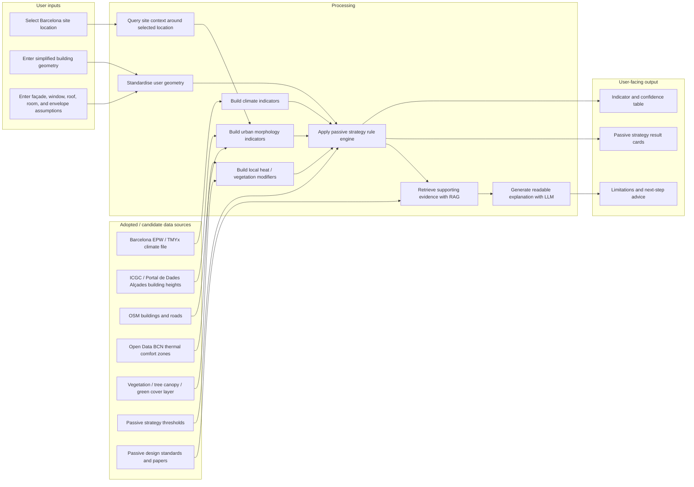

# System Sketch v0 — Passive Design Advisor: Barcelona 2025

> Repo-aligned version regenerated after checking the project brief, data inventory, quality audit template, and dataset/pipeline summary.
>
> System principle: **rules decide, RAG explains, LLM communicates**.

---

## The diagram

---

## Component descriptions

### Sources

- **Barcelona EPW / TMYx weather file**
  - What it provides: hourly temperature, humidity, wind speed/direction, and solar radiation.
  - Which sub-question(s) it serves: climate resolution, overheating risk, night cooling, solar exposure, wind potential.
  - Format / cadence: `.epw`, converted to `.csv`; typical meteorological year.
  - Datasheet: `docs/datasheets/barcelona-epw-tmyx.md`

- **ICGC / Barcelona Portal de Dades — MTM Alçades building heights**
  - What it provides: building-volume polygons with `Z_MIN_VOL` and `Z_MAX_VOL`; derived height = `Z_MAX_VOL - Z_MIN_VOL`.
  - Which sub-question(s) it serves: surrounding height, obstruction, canyon ratio, roof exposure, wind sheltering.
  - Format / cadence: GeoPackage; downloaded local files: `Base - Alçades.gpkg`, `Sintètic - Alçades.gpkg`, `Situació - Alçades.gpkg`.
  - Datasheet: `docs/datasheets/barcelona-mtm-building-heights.md`

- **OSM buildings and roads**
  - What it provides: footprints, roads, possible street network and contextual geometry.
  - Which sub-question(s) it serves: surrounding footprints, road context, approximate street width, density.
  - Format / cadence: Overpass GeoJSON or Geofabrik extract.
  - Datasheet: `docs/datasheets/osm-barcelona-buildings-roads.md`

- **Open Data BCN — Thermal Comfort Zones**
  - What it provides: neighbourhood-scale thermal comfort / heat risk classification.
  - Which sub-question(s) it serves: local heat-risk adjustment beyond base EPW.
  - Format / cadence: GeoPackage / polygon lookup.
  - Datasheet: `docs/datasheets/barcelona-thermal-comfort-zones.md`

- **Vegetation / tree canopy / green cover layer**
  - What it provides: local greenness or canopy coverage around the site.
  - Which sub-question(s) it serves: cooling context, green roof justification, ecological layer.
  - Format / cadence: Copernicus Street Tree Layer, NDVI raster, OSM green areas, or local municipal greenery data.
  - Datasheet: `docs/datasheets/barcelona-vegetation-context.md`

- **Passive strategy thresholds**
  - What it provides: strategy logic for shading, cross-ventilation, night purge, thermal mass, green roof.
  - Which sub-question(s) it serves: converts indicators into YES / PARTIAL / NO and HIGH / MEDIUM / LOW.
  - Format / cadence: `.csv` or `.json`, manually curated and versioned.
  - Datasheet: `docs/datasheets/passive-strategy-thresholds.md`

- **Passive design standards and papers**
  - What it provides: explanation evidence for the RAG module.
  - Which sub-question(s) it serves: why a strategy is recommended and what limitation applies.
  - Format / cadence: PDF / text / markdown chunks.
  - Datasheet: `docs/datasheets/passive-design-knowledge-base.md`

---

## Processing

- **Step 1: Standardise user geometry**
  - **Input:** location, massing, façade orientation, WWR, roof area, room depth, openings, construction type.
  - **Output:** clean building-geometry JSON.
  - **Transformation:** validate units, calculate WWR, classify façade orientation, check missing values, assign geometry IDs.

- **Step 2: Query site context around selected location**
  - **Input:** site coordinate.
  - **Output:** clipped/contextual spatial layers around 50 m / 100 m radius.
  - **Transformation:** reproject CRS, spatial buffer, intersect with footprints, heights, roads, comfort zones, and vegetation layers.

- **Step 3: Build climate indicators**
  - **Input:** Barcelona EPW weather file.
  - **Output:** climate indicator table.
  - **Transformation:** calculate summer overheating hours, daytime heat risk, night temperature drop, prevailing wind direction, and solar exposure risk.

- **Step 4: Build urban morphology indicators**
  - **Input:** surrounding footprints, heights, roads, and user building geometry.
  - **Output:** morphology indicator table.
  - **Transformation:** calculate surrounding height, obstruction proxy, distance to nearby buildings, canyon ratio proxy, roof exposure, and wind sheltering proxy.

- **Step 5: Build local heat / vegetation modifiers**
  - **Input:** thermal comfort zone and vegetation layer.
  - **Output:** local modifier values.
  - **Transformation:** point-in-polygon lookup, vegetation ratio within buffer, convert to low / medium / high modifier.

- **Step 6: Apply passive strategy rule engine**
  - **Input:** geometry indicators, climate indicators, morphology indicators, local heat modifiers, threshold table.
  - **Output:** ranked passive strategy results.
  - **Transformation:** apply documented IF / THEN rules; return YES / PARTIAL / NO, HIGH / MEDIUM / LOW impact, and confidence label.

- **Step 7: Retrieve supporting evidence with RAG**
  - **Input:** rule-engine result and selected strategy.
  - **Output:** relevant evidence snippets from standards / design literature.
  - **Transformation:** retrieve evidence by strategy topic and indicator type.

- **Step 8: Generate readable explanation with LLM**
  - **Input:** rule result, indicator values, evidence snippets, limitation flags.
  - **Output:** concise user-facing explanation.
  - **Transformation:** explain result without changing the score; include caveats and next steps.

---

## Output

- **Form:** Web tool / app with strategy cards and an annotated report panel.
- **What the user does with it:** The architect decides which passive strategies are physically worth developing or simulating further.
- **Cross-reference:** see `output-sketch-v0.md` for user-facing detail.

---

## Boundaries

### In scope

- Evaluate proposed building geometry during early design stage.
- Use hourly climate and local context data to derive passive design indicators.
- Rank passive strategies using documented rule-based thresholds.
- Explain the result using RAG-supported evidence.
- Display confidence and limitations for each strategy.

### Out of scope

- Predicting actual indoor temperature for existing buildings.
- Running full EnergyPlus / DesignBuilder / compliance simulation.
- Producing certified energy, health, or regulatory claims.
- Automatically designing final façade or roof construction details.
- Training a black-box model to decide passive strategies without explainable rules.

---

## Open seams

- **Seam 1: Passive strategy thresholds**
  - Why it's a seam: threshold values for LOW / MEDIUM / HIGH impact need literature support and validation.
  - Plan: create `strategy_thresholds.csv` with source and confidence columns; validate against one or more reference cases.

- **Seam 2: Minimum viable geometry input**
  - Why it's a seam: the repo has not yet proven whether manual input is enough or whether a simplified 3D model is required.
  - Plan: test a simple JSON input first, then compare with Rhino / Revit / IFC extraction later.

- **Seam 3: Local heat layer vintage**
  - Why it's a seam: municipal thermal comfort layers may use older inputs and may not reflect recent urban interventions.
  - Plan: show the vintage as a limitation and use it only as an adjustment layer, not ground truth.

- **Seam 4: OSM / street-width uncertainty**
  - Why it's a seam: street width and height tags may be incomplete.
  - Plan: use OSM for roads/footprints, use Alçades for height, and flag inferred street width as medium-confidence.

---

## Sign-off

**Team:** Gaelle Habib, Chun-Chun Chang, Nithik Vairamuthu, Vimal TN  
**Drawn by:** [name]  
**Last updated:** 2026-05-17
