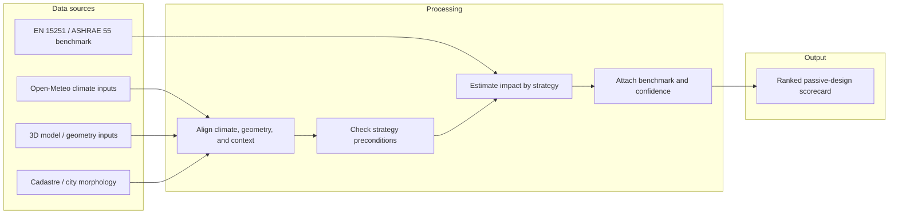

# System Sketch v0

> One-page diagram + descriptions. This is a calculation system, not a training pipeline: it reads real inputs, checks physical preconditions, estimates impact, and explains the scorecard.

---

## The diagram

> **Tip:** every box should have a verb. Every arrow should be a contract (this thing flows from here to there in this format).

---

## Component descriptions

### Sources *(left side — what comes in)*

- **Source 1:** Open-Meteo climate inputs
  - What it provides: solar radiation by direction and hour, prevailing wind speed and direction, dry bulb temperature and diurnal swing, humidity, and sky-condition proxy.
  - Which sub-question(s) it serves: climate inputs for the scorecard and benchmark comparison.
  - Format / cadence: hourly API data or historical archive pull.
  - Datasheet: [dataset-datasheet.md](dataset-datasheet.md)

- **Source 2:** 3D model / geometry inputs
  - What it provides: façade orientations and areas, window-to-wall ratio per façade, roof area and exposure, floor-to-ceiling height, thermal mass of the envelope, existing shading elements.
  - Which sub-question(s) it serves: strategy preconditions and physical feasibility.
  - Format / cadence: user-provided 3D model export or structured parameter form.
  - Datasheet: 

- **Source 3:** Cadastre / city morphology
  - What it provides: surrounding building heights, street-canyon geometry, distance to open spaces, urban heat island intensity for the location.
  - Which sub-question(s) it serves: shadow obstruction, wind channelling, and local cooling context.
  - Format / cadence: GIS layers / open city datasets.
  - Datasheet: 

- **Source 4:** EN 15251 / ASHRAE 55 benchmark
  - What it provides: adaptive thermal comfort standards for naturally ventilated buildings in Barcelona-like climate.
  - Which sub-question(s) it serves: what counts as acceptable indoor temperature range and when a strategy is meaningful.
  - Format / cadence: standards text and derived thresholds.
  - Datasheet: 

### Processing *(middle — what happens)*

- **Step 1:** Align inputs
  - **Input:** climate inputs, geometry inputs, city morphology.
  - **Output:** one harmonized building-level table.
  - **Transformation:** convert everything to the same coordinate system, time window, and building record.

- **Step 2:** Check preconditions
  - **Input:** harmonized table.
  - **Output:** YES / PARTIAL / NO for each passive strategy.
  - **Transformation:** ask whether the geometry and urban context make the strategy physically possible.

- **Step 3:** Estimate impact and rank
  - **Input:** preconditions, climate inputs, benchmark thresholds.
  - **Output:** HIGH / LOW / NOT APPLICABLE impact estimates with confidence labels.
  - **Transformation:** compare the inputs to the benchmark and assign a transparent score rather than a hidden model prediction.

### Output *(right side — what the user sees)*

- **Form:** dashboard
- **What the user does with it:** enters a building descriptor and gets a passive-design scorecard that explains which strategies are physically actionable and why.
- **Cross-reference:** see [output-sketch-v0.md](output-sketch-v0.md) for the user-facing detail.

---

## Boundaries

### In scope

- Barcelona design-stage passive-design evaluation.
- Calculation of strategy preconditions from climate, geometry, and urban context.
- Scorecard output with benchmark-based explanation and confidence labels.

### Out of scope

- Direct indoor comfort prediction without indoor measurements.
- Full energy simulation or certification workflow.
- Training a new predictive model from scratch.

---

## Open seams

- **Seam 1:** Urban context resolution
  - Why it's a seam: the city morphology layer may not capture every canyon or courtyard detail.
  - Plan: use it as a context flag and keep the confidence label visible.

- **Seam 2:** Climate source choice
  - Why it's a seam: open meteo inputs may differ in how they represent sky conditions and radiation.
  - Plan: document the exact source and use the same one consistently in the notebook and audit.

- **Seam 3:** Benchmark threshold mapping
  - Why it's a seam: the adaptive comfort standard does not automatically tell us the best passive strategy.
  - Plan: derive strategy thresholds from the standard and keep them editable in the logic table.

---

## Sign-off

**Team:** Gaelle Habib, Chun-Chun Chang, Nithik Vairamuthu, Vimal TN
**Drawn by:** Team draft
**Last updated:** 2026-05-04
