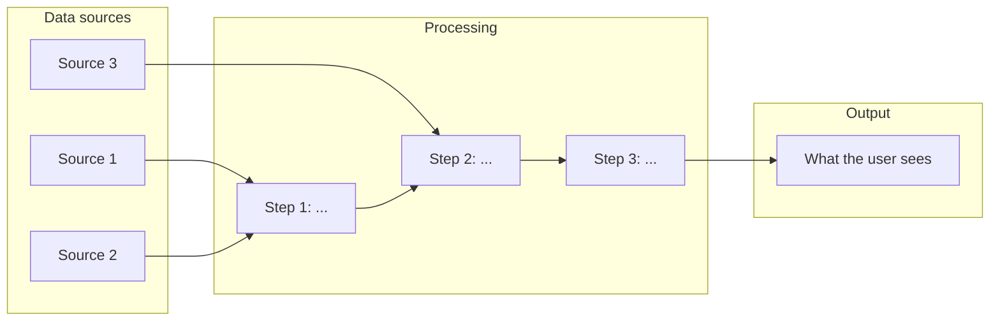

# System Sketch v0

> One-page diagram + descriptions. Forces you to think system, not script.
>
> Master's-level architecture and design students aren't shipping a
> notebook script — you're shipping a **system** a professional can use.
> Drawing the system surfaces the seams that don't yet have data, the
> arrows where logic is missing, and the boundaries that protect you
> from scope creep.
>
> Save as `docs/system-sketch-v0.md` in your repo. GitHub renders Mermaid
> blocks natively in markdown — no extra tools needed. (Excalidraw or
> hand-drawn is also fine — just embed the image.)

---

## The diagram

> **Tip:** every box should have a verb. Every arrow should be a contract
> (this thing flows from here to there in this format).

---

## Component descriptions

### Sources *(left side — what comes in)*

- **Source 1:** [name]
  - What it provides: 
  - Which sub-question(s) it serves: 
  - Format / cadence: 
  - Datasheet: `docs/datasheets/<slug>.md`

- **Source 2:** [name]
  - What it provides: 
  - Which sub-question(s) it serves: 
  - Format / cadence: 
  - Datasheet: 

- **Source 3:** [name]
  - What it provides: 
  - Which sub-question(s) it serves: 
  - Format / cadence: 
  - Datasheet: 

### Processing *(middle — what happens)*

- **Step 1:** 
  - **Input:** 
  - **Output:** 
  - **Transformation:** 

- **Step 2:** 
  - **Input:** 
  - **Output:** 
  - **Transformation:** 

- **Step 3:** 
  - **Input:** 
  - **Output:** 
  - **Transformation:** 

### Output *(right side — what the user sees)*

- **Form:** *(dashboard / report / notebook tool / web app / Grasshopper
  component / API)*
- **What the user does with it:** *(one sentence)*
- **Cross-reference:** see `output-sketch-v0.md` for the user-facing detail.

---

## Boundaries

### In scope

*What this system explicitly does. Use bullets that name capabilities.*

- 
- 
- 

### Out of scope

*What this system explicitly does NOT do. This protects you from scope creep.*

- 
- 
- 

---

## Open seams

*Where in the diagram is data missing? Where is logic uncertain? Name 1–3
seams. These are tomorrow's problems made visible.*

- **Seam 1:** 
  - Why it's a seam: 
  - Plan: 

- **Seam 2:** 
  - Why it's a seam: 
  - Plan: 

- **Seam 3:** 
  - Why it's a seam: 
  - Plan: 

---

## Sign-off

**Team:** [names]
**Drawn by:** [name]
**Last updated:** [YYYY-MM-DD]
